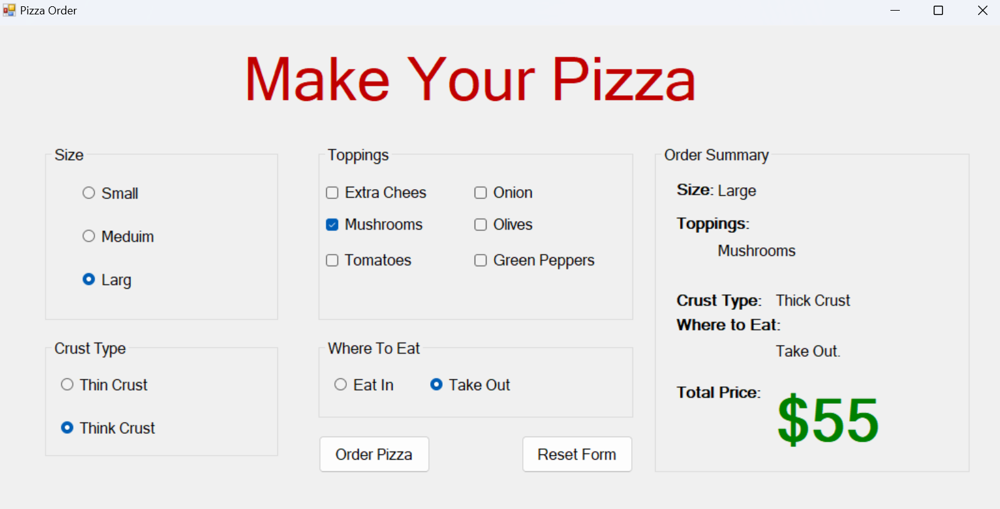
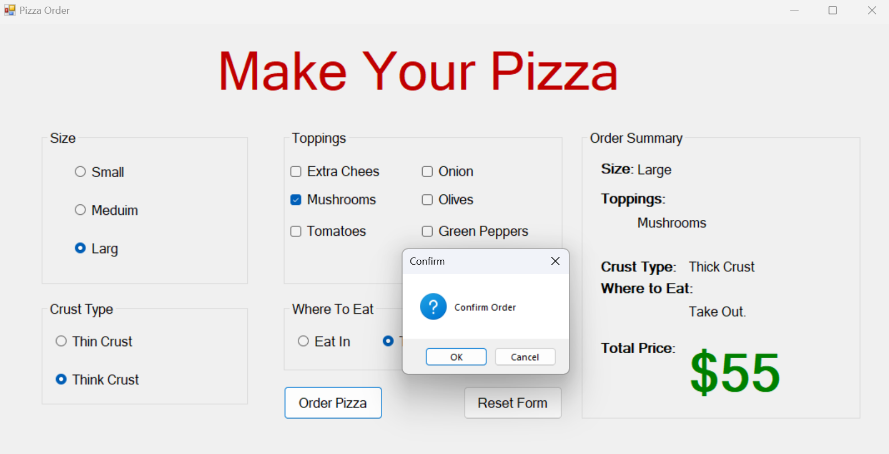

# Pizza Ordering System
A Windows Forms application in C# for ordering and customizing pizzas.

---

## 📌 Description
Allows users to build a custom pizza by selecting size and toppings, with automatic price calculation, through a simple graphical interface.

---

## 🛠️ Technologies
- C#
- Windows Forms (WinForms)
- .NET Framework
- OOP

---

## 🎯 Features
- Pizza size and topping selection
- Real-time price calculation
- Simple, interactive GUI
- Order summary display

---

## 📷 Preview

  
  

---

## ✍️ Author
Hazem Ahmad Hazem  
- GitHub: https://github.com/HazemAhmadHaz
- LinkedIn: https://www.linkedin.com/in/hazem-ahmad-haz
- Email: HazemAhmad01234@gmail.com
